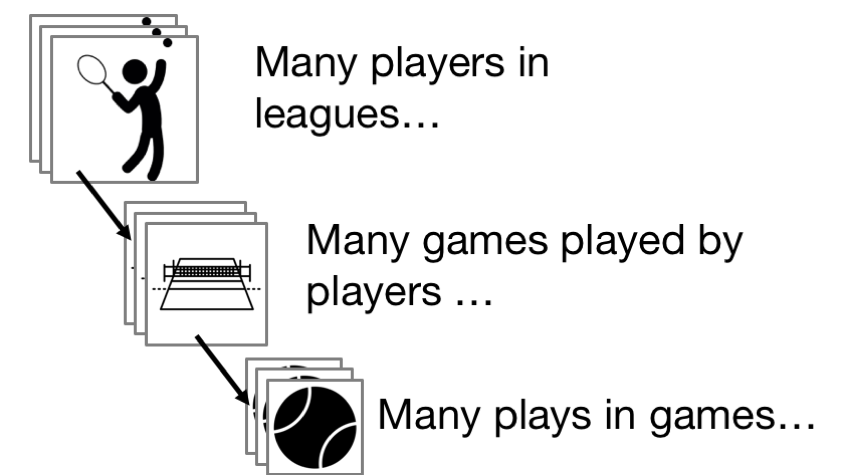

```{r setup, include = FALSE, message = FALSE}
options(htmltools.dir.version = FALSE)

library(deuce)
library(dplyr)
library(tidyr)
library(ggthemes)
library(ggplot2)
library(scales)
library(htmlTable)
library(stringr)
library(lubridate)

set.seed(1115808)
```


# Hierarchies


<b>Hierarchies are abundant in sports data.</b>



---

# Why Hierarchies Matter

.pull-left[
- Observations that are 'grouped' tend to correlate 

- But standard models treat observations as independent

- We need special models to account for dependence in hierarchical data
]

.pull-right[

]

--

<br>

Let's look at an example with tennis serve outcomes...

---

# Tennis Serve

The tennis serve is one of the most important skills in tennis. Why?


---

# The Serve Advantage

```{r echo = FALSE, warning = FALSE, message = FALSE}
library(ggjoy)

data(atp_matches)

points_on_serve <- atp_matches %>%
    filter(!is.na(w_svpt), w_svpt > 0, tourney_level == "Grand Slams") 

serve <- points_on_serve %>%
    dplyr::mutate(
      serve_pct = (w_1stWon +  w_2ndWon) / w_svpt,
      return_pct = 1 - (l_1stWon +  l_2ndWon) / l_svpt,
      diff = serve_pct - return_pct
    )

serve <- serve %>%
    gather("type", "percent", serve_pct, return_pct)

serve$type <- ifelse(serve$type == "serve_pct", "Serve", "Return")

serve %>%
    ggplot(aes(x = percent * 100, y = type, fill = type)) + 
    geom_joy() +
    scale_fill_tableau() + 
    scale_y_discrete("Point Type") + 
    scale_x_continuous("Win Percentage") + 
    theme_joy() + theme(legend.position = "none")
```

---

# Modelling Serve Win Outcomes

Because of the importance of the serve in tennis, modelling serve performance becomes an important part of performance analysis

--

A good service model can help us to:

- Set expectations of what a player is expected to do on serve

- Determine if a player performed better or worse than expected

- Identify factors that influence the serve performance

---

# Tennis Data

The `deuce` package is a helpful resource for match, point, and shot-level data about tennis.

It is available for download on GitHub.

```{r eval = FALSE}
library(devtools)

install_GitHub('skoval/deuce')
```

---

# Service Data

The data set `atp_matches` and `wta_matches` has match-level summaries of matches from 1968 to the present. 

- Every row corresponds to one match

- Statistics for the number of service points played and won are available from early 2000s to the present

- The statistics are organised by match winner and loser (`svpt` is total service points, `1stWon` are first serves won, `2ndWon` are second serves won)

```{r echo = T}
data(atp_matches)

tail(atp_matches %>%
    filter(tourney_level == "Grand Slams") %>%
    select(tourney_name, surface,  winner_name, 
           loser_name, w_svpt, w_1stWon, w_2ndWon))
```

---

# 2017 Grand Slams

Let's prepare data with men's service outcomes for the 2017 Grand Slams

```{r echo = T}
slams_2017 <- atp_matches %>%
    filter(year == 2017, tourney_level == "Grand Slams") %>%
    select(tourney_name, surface, 
           winner_name, w_svpt, w_1stWon, w_2ndWon,
           loser_name, l_svpt, l_1stWon, l_2ndWon) %>%
    dplyr::mutate(
      w_servewon = w_1stWon + w_2ndWon,
      l_servewon = l_1stWon + l_2ndWon
    )

winner <- loser <- slams_2017

names(winner) <- sub("winner|w_", "player", names(winner))
names(loser) <- sub("loser|l_", "player", names(loser))

names(loser) <- sub("winner|w_", "opponent", names(loser))
names(winner) <- sub("loser|l_", "opponent", names(winner))

slams_2017 <- rbind(winner, loser)
```

---


# Any Hierarchies?

Yes, there are different matches and number of service points across players.

```{r}
slams_2017 %>%
  group_by(player_name) %>%
  dplyr::summarise(
    matches = n()
  ) %>%
  ggplot(aes(x = player_name, y = matches)) + 
  geom_bar(stat = "identity", fill = "#e5952c") + 
  coord_flip() + 
  theme_hc() + 
  scale_y_continuous("Matches") + 
  scale_x_discrete("")
```

---

# Grand Slam Serve Win

Given these data, what might be a reasonable model for a player's service percentage won against a given opponent?

--

We will consider a model that includes the following factors:

- Player average serve ability

- Opponent's average return ability

- Surface

---


# Model Notation


$$
p_{ij} = \beta + \beta_1 grass + \beta_2 clay + a_i + b_j
$$
- $p_{ij}$ service proportion won for server $i$ vs receiver $j$

- $\beta$ intercept/surface effects

- $a_i$ is a server effect

- $b_j$ is the receiver effect

---

# Fitting a Hierarchical Model

There are two main approaches:

- Likelihood-based

- Bayesian

---

# Likelihood-Based

We can use the `lme4` package for fitting hierarchical models for exponential family distributions. Below is a binomial logistic model for the serve win proportion. 

```{r message = F}
library(lme4) # Linear mixed effects

fit <- glmer(
  cbind(playerservewon, playersvpt - playerservewon) ~
    I(surface == "Grass") + 
    I(surface == "Clay") + 
    (1 | player_name) +
    (1 | opponent_name),
  data = slams_2017,
  family = "binomial"
)
```

---

# Likelihood-Based

- Outcomes are given as a matrix of the count of success and failures

- Normal random effects for a `group` variable are given as `(1 | group)`

- The default link for `binomial` is the logit link

---

# Summarising Model

The fixed effects our the `betas` of the model and tell us about the average serve expectations on different surfaces on the log-odds scale

```{r}
summary(fit)
```


---


# Serve Win on Hard Court Serve 

The average effect on hard court on the probability scale can be easily computed along with a confidence interval. 


```{r message = F}
expit <- function(x) exp(x) / (1 + exp(x)) # Inverse logit

expit(fixef(fit)[1])

expit(confint(fit, "(Intercept)"))
```


---

# How Do Servers Differ from the Average?

Empirical Bayes estimates of server effects can be obtained from the `ranef` function. Below we put these into a dataframe and mutate to be on the probability scale.

```{r}
player_effects <- ranef(fit) # ranef.mer object

player_effects <- data.frame(
    serve_effect = expit(player_effects[["player_name"]][,1] + fixef(fit)[1]) - expit(fixef(fit)[1]),
    player_name = rownames(player_effects[["player_name"]]),
    stringsAsFactors = F
)
```


---


# How Does this Compare with the Observed?

To make a visual comparison, we can obtain the averages per player on hard court (our reference surface) and see how that deviates from the estimated average

```{r}
observed_effects <- slams_2017 %>%
  filter(surface == "Hard") %>%
  group_by(player_name) %>%
  dplyr::summarise(
    matches = n(),
    serve_effect = mean(playerservewon / playersvpt) - expit(fixef(fit)[1])
  )

combine <- observed_effects %>%
  inner_join(player_effects, by = "player_name")
```


---

# How Does this Compare with the Observed?

```{r echo = F}
combine %>%
    ggplot(aes(x = "Observed", xend = "Estimated", 
               y = serve_effect.x, yend = serve_effect.y, group = player_name, col = matches)) + 
  geom_hline(yintercept = 0, col = "red") + 
  geom_segment() + 
  theme_hc() + 
  scale_y_continuous("Service Effect")
```


---

# What's Going On?

- Our esimtates are generally closer to the average (zero line) than the observed

--

- This is most true for players with fewer matches

--

- This phenomenon is known as 'shrinkage' 

--

- Shrinking less certain observations to the mean is a natural byproduct of hierarchical models


---

# James-Stein Shrinkage

The 'OG' of shrinkage estimators was the 1961 estimator proposed by Willard James and Charles Stein. The general form of this and other shrinkage estimators, for some shrinkage weight $B$, is:

$$
\hat{x}_i = \bar{x}_i + B (\bar{x} -\bar{x}_i)
$$

- $\bar{x}_i$ is the average we observe

- $\bar{x}$ is the global average

- $B$ is a weight that is closer to 1 when $\bar{x}_i$ is less certain

---

# Sport Has Been a Huge Motivator for Shrinkage Estimation


---

# Bayesian Hierarchies

We can also fit a Bayesian hierarchical model to estimate server win expectations. The Bayesian framework has the advantage that:

- We can incorporate subjective information with the prior

- We have more flexibility in the structure and distribution of group factors

- It is easy to derive summaries for functions of the model parameters

--

* Some criticse Bayes for using priors and being too computational intensive

---

# Bayesian Model

With Bayesian models, we need to specify distributions for our outcome _and_ parameters. 

$$
p_{ij} = \beta + \beta_1 grass + \beta_2 clay + a_i + b_j
$$


$$y_{ij} \sim Binomial(p_{ij}, n_{ij})$$

$$\boldsymbol{\beta} \sim MVN(\mu_\beta, \Sigma_\beta)$$
$$a_i \sim N(0, \sigma_a^2)$$

$$b_j \sim N(0, \sigma_b^2)$$

In this example we will use non-informative priors for all of the hyperparameters above.

---

# Implementing in `rjags`

`rjags` is a popular package for implementing Bayesian inference with Gibbs sampling.

```{r message = FALSE}
library(rjags)

modelString = "
  model{

    for(i in 1:N) {   

      servewon[i] ~ dbinom(p[i], n[i])
	  
      logit(p[i]) <- beta[1] + beta[2] * grass[i] + beta[3] * clay[i] + a[j[i]] + b[k[i]]
      }
      
     for(l in 1:J){
      a[l] ~ dnorm(0, tau.sigma.a)
     }
	
     for(l in 1:K){
      b[l] ~ dnorm(0, tau.sigma.b)
     }

 	  tau.sigma.a <- pow(sigma.a, -2)
 	  sigma.a ~ dunif(0, 100)

 	  tau.sigma.b <- pow(sigma.b, -2)
 	  sigma.b ~ dunif(0, 100)
  
    beta[1:3] ~ dmnorm(mean[1:3], prec[1:3 , 1:3])
    Tau.B[1:3 , 1:3] ~ dwish(Omega[1:3, 1:3], 3)  
}
"
```

---

# Prepare Data

Below we set up our indices and hyperparameter constants.

```{r}
N <- nrow(slams_2017)

j <- rep(0, N)

counter <- 0

for (k in unique(slams_2017$player_name)){
  l <- (slams_2017$player_name == k)
  counter <- counter + 1
  j[l] <- counter
}

k <- rep(0, N)

counter <- 0

for (x in unique(slams_2017$opponent_name)){
  l <- (slams_2017$opponent_name == x)
  counter <- counter + 1
  k[l] <- counter
}

mean <-  c(0, 0, 0)

Omega <- diag(c(.1,.1,.1))

prec <- diag(c(1.0E-6,1.0E-6,1.0E-6))

J <- length(unique(slams_2017$player_name))
K <- length(unique(slams_2017$opponent_name))
```

---

# Run the JAGS model

Use the `jags.model` to run the model for our sample data and set the number of chains and adaptation length.

```{r}
jags <- jags.model(textConnection(modelString),
                   data = list('servewon' = slams_2017$playerservewon, 
                               'n' = slams_2017$playersvpt,
                               'grass' =  as.numeric(slams_2017$surface == "Grass"),
                               'clay' =  as.numeric(slams_2017$surface == "Clay"),
                               'j' = j, 
                               'k' = k, 
                        'N' = N,
                        'J' = J, 
                        'K' = K, 
                        'mean' = mean,
                        'Omega' = Omega,
                        'prec' = prec),
                   n.chains = 3,
                   n.adapt = 1000)
```

---

# Assessing Convergence

Trace plots and Gelman-Rubin stats are common diagnostics for posterior convergence. Here is an example with the intercept parameter.

```{r}
samples <- coda.samples(jags,
                        c('beta[1]'),
                        1000)

plot(samples) # Trace plot

gelman.plot(samples) # Gelman chain similarity
```

---

# Summarising Posteriors 

Let's take one chain of results to summarise the overall and player serve variables.

```{r}
server <- coda.samples(jags,
                        c('a'),
                        1000)

server_effects <- 
  expit(server[[1]] + matrix(samples[[1]], nrow = 1000, ncol = ncol(server[[1]]))) - 
          expit( matrix(samples[[1]], nrow = 1000, ncol = ncol(server[[1]])))

server_effects <- colMeans(server_effects) # Posterior mean

server_effects <- data.frame(
    serveid = str_extract(names(server_effects), "[0-9]+"),
    serve_effect = server_effects,
    stringsAsFactors = F
)
```

---

# Compare to Observed

```{r}
slams_2017$serveid <- as.character(j)

observed_effects <- slams_2017 %>%
  group_by(serveid) %>%
  dplyr::summarise(
    matches = n(),
    serve_effect = mean(playerservewon / playersvpt) - mean(expit(samples[[1]]))
  )

combine <- observed_effects %>%
  inner_join(server_effects, by = "serveid")

combine %>%
    ggplot(aes(x = "Observed", xend = "Estimated", 
               y = serve_effect.x, yend = serve_effect.y, group = serveid, col = matches)) + 
  geom_hline(yintercept = 0, col = "red") + 
  geom_segment() + 
  theme_hc() + 
  scale_y_continuous("Service Effect")
```

---

# Summary

- Hierarchical models are a common occurrence in sport

- These models can be a natural way to introduce shrinkage to player-specific effects

- There are easy-to-use, powerful tools for implementing likelihood-based and Bayesian hierarchical models in R 


---


# Resources

- [lme4](https://www.jstatsoft.org/article/view/v067i01/v67i01.pdf)

- https://martynplummer.wordpress.com/category/jags/

- The BUGS Book: A Practical Introduction to Bayesian Analysis

- http://www-math.bgsu.edu/~albert/bcwr/
